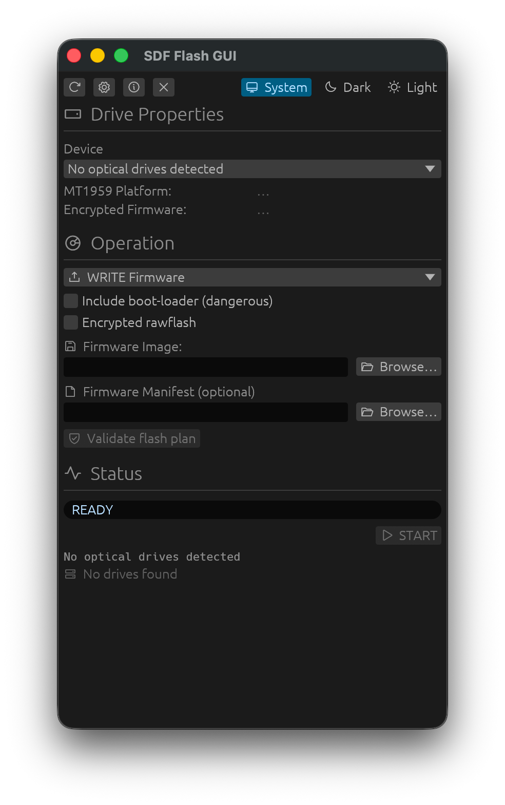

<p align="center">
  
</p>

<h1 align="center">SDF Flash GUI</h1>

<p align="center">
  <a href="https://github.com/thedavidweng/sdf-flash-gui/actions/workflows/ci.yml"></a>
  <a href="https://codecov.io/gh/thedavidweng/sdf-flash-gui"></a>
</p>

Cross-platform GUI for optical drive firmware dump/flash. Inspired by the Windows-only `SDFtool Flasher.exe`

<p align="center">
  
</p>

## Features

- **Drive enumeration** — auto-detects optical drives on macOS, Linux, and Windows
- **Drive info** — vendor, model, firmware revision, MT1959 platform detection, encrypted firmware detection
- **Firmware dump** — saves drive firmware to file via the selected backend
- **Firmware flash** — multi-gate safety validation before execution:
  - Model/revision matching against firmware manifest (glob patterns)
  - SHA-256 payload verification
  - Signature presence check (presence only — not cryptographic validity)
  - User confirmation string required
- **Multi-image manifests** — image selector when a manifest contains multiple firmware images
- **Encrypted / full boot-loader rawflash** — mutually exclusive flash modes
- **Recovery flash** — boot token entry or extraction from a wrong firmware dump (offset `0x3000`)
- **SDF0 container parsing** — reads `sdf.bin` metadata (vendor, model, firmware version, encryption, compression)
- **Dual backend support** — works with both `sdftool` (standalone) and `makemkvcon` (MakeMKV); auto-detected via PATH or common install locations

## Install

**macOS (Homebrew)**

```bash
brew install --cask thedavidweng/tap/sdf-flash-gui
```

**Linux / Windows**

Download the latest installer from [Releases](https://github.com/thedavidweng/sdf-flash-gui/releases) — `.deb` / `.AppImage` for Linux, `.msi` for Windows.

## Requirements

- [MakeMKV](https://www.makemkv.com/) installed on the system (provides `makemkvcon`) or standalone `sdftool`
- `sdf.bin` from the SDFtool/MKV firmware pack (optional, for SDF container parsing)

### Platform permissions

| Platform | Notes |
|----------|-------|
| **Linux** | Optical drive access often requires membership in the `cdrom` group or running with sufficient permissions to open `/dev/sr*`. |
| **macOS** | Drive access is usually available to the logged-in user. |
| **Windows** | Some raw device operations may require running as Administrator. |

## Firmware manifests

Manifest `sha256` fields must be the hash of the **complete firmware file** selected for flashing, not an extracted payload inside a multi-image pack. See `SECURITY.md` for vulnerability reporting.

## Build

```bash
cargo build --release
```

Output: `target/release/sdf-flash-gui` (~4 MB, single binary, no runtime deps beyond the backend).

## Architecture

```
src/
  main.rs            CLI entry (no-args launches GUI)
  orchestration.rs   Shared flash pipeline: probe → validate → plan → execute
  command.rs         Backend argv planner (no shell strings)
  process.rs         Process run/stream/cancel + ProcessRunner seam
  flash.rs           Manifest safety gates + advisory warnings
  manifest.rs        Firmware manifest parser + drive matching
  drive.rs           Drive enumeration, identity, backend/sdf.bin discovery
  sdf.rs             SDF0 container parser
  gui/               egui shell (state, ops, workers, views) — uses orchestration
```

CLI and GUI share the same flash/probe planning logic via `orchestration`.

## Acknowledgements

- **MakeMKV**
- **MartyMcNuts** for creating the original Windows-based SDFtool Flasher. See the release thread here: [https://forum.makemkv.com/forum/viewtopic.php?f=16&t=22896](https://forum.makemkv.com/forum/viewtopic.php?f=16&t=22896)

## License

GPL-2.0-or-later
